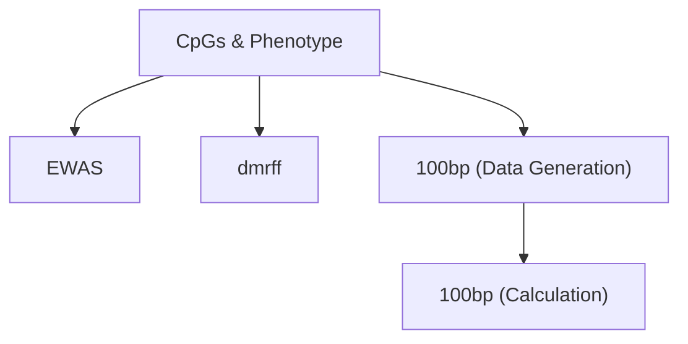

# AMRs.finder

[TODO]: Description

## Install

```sh
git pull https://github.com/CORRS-LAB/AMRs.finder
cd AMRs.finder
R CMD INSTALL package
```

## Demo

With `AMRs.finder::AMR.finder`, one could perform the following calculation:

```R
## Load Demo data
intput_dat = readRDS("data/bulk.sub.txt.20.Rds")
## generate y
y <- data.frame(y=rpois(20, 50))
## define covariate matrix
cov.mod <- NULL
library(AMRs.finder)
nfo <- AMR.finder(intput_dat, y, cov.mod)
head(nfo)
```


The Result is as following:

|chr   |   start|     end| #CpGs|    cor_est|    coef_lm|   p_value|     methX| methY|       FDR|
|:-----|-------:|-------:|-----:|----------:|----------:|---------:|---------:|-----:|---------:|
|chr21 | 9437431| 9437538|    14|  0.5832074|  38.328544| 0.0069528| 0.6017233|    49| 0.2759106|
|chr21 | 9825466| 9825568|    12|  0.1596132|  11.463980| 0.5014693| 0.2783314|    49| 0.6066556|
|chr21 | 9825571| 9825600|     5|  0.1243991|   9.382826| 0.6012908| 0.2705365|    49| 0.6540356|
|chr21 | 9825839| 9825864|     5| -0.2768194| -16.275038| 0.2373935| 0.3259030|    49| 0.4405461|
|chr21 | 9825870| 9825894|     6| -0.2385190| -13.892837| 0.3111941| 0.4334588|    49| 0.4909643|
|chr21 | 9826120| 9826207|    20| -0.0306179|  -2.452290| 0.8980380| 0.2583344|    49| 0.8980380|

The detailed description of the above output is in the following:

| Output | Description | 
|:-----|:--------|
| chr | Chromosome | 
| start | The start position of a methylation region. | 
| end | The start position of a methylation region. | 
| #CpGs | The number of CpG sites.|
| cor_est | The estimated correlation coefficient. | 
| coef_lm | The methylation coefficient derived from linear regression analysis. | 
| p_value |  The methylation P value derived from linear regression analysis. | 
| methX | Mean DNA methylation level within each region across all samples.|
| methY | Mean phenotype value within each region across all samples.|
| FDR | False discovery rate using BH approach.|


## Further example to test ewas and others

| Demo | Link | Comments |
|:-----|:-----|:---------|
| ewas | [ewas](./scripts/demo-ewas.R) |  Perform correlation and linear regression analyses to each CpG site.|
| dmrff | [dmrff](./scripts/demo-dmrff.R) | Dynamically identify methylation regions associated with phenotype using `dmrff`. Install [dmrff](https://github.com/perishky/dmrff) (referred to https://doi.org/10.1101/508556) first.|
| 100bp-gen | [Data-generation](./scripts/demo-100bp-generation.R) |  Segment CpG sites into non-overlapping 100bp genomic regions.|
| 100bp-cal | [Calculation](./scripts/demo-100bp-cal.R) | Perform correlation and linear regression analyses to 100bp genomic regions.|


